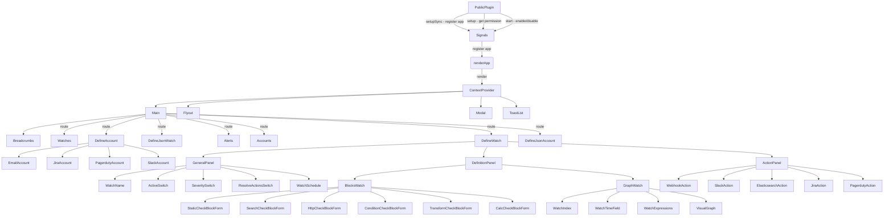

# Signals FE

```mermaid
graph TD
    A[PublicPlugin] -->|setupSync - register app| B[Signals]
    A[PublicPlugin] -->|setup - get permission| B[Signals]
    A[PublicPlugin] -->|start - enable/disable| B[Signals]
    B -->|register app| C(renderApp)
    C -->|render| D[ContextProvider]
    D --> E[Main]
    D --> DA[Flyout]
    D --> DB[Modal]
    D --> DC[ToastList]
    E --> F[Breadcrumbs]
    E -->|route| G[Watches]
    E -->|route| H[DefineWatch]
    E -->|route| I[DefineJsonWatch]
    E -->|route| J[Alerts]
    E -->|route| K[Accounts]
    E -->|route| L[DefineAccount]
    E -->|route| M[DefineJsonAccount]
    L --> LA[EmailAccount]
    L --> LB[JiraAccount]
    L --> LC[PagerdutyAccount]
    L --> LD[SlackAccount]
    H --> HA[GeneralPanel]
    H --> HB[DefinitionPanel]
    H --> HC[ActionPanel]
    HA --> HAA[WatchName]
    HA --> HAB[ActiveSwitch]
    HA --> HAC[SeveritySwitch]
    HA --> HAD[ResolveActionsSwitch]
    HA --> HAE[WatchSchedule]
    HB --> HBA[BlocksWatch]
    HB --> HBB[GraphWatch]
    HC --> HCA[WebhookAction]
    HC --> HCB[SlackAction]
    HC --> HCC[ElasticsearchAction]
    HC --> HCD[JiraAction]
    HC --> HCE[PagerdutyAction]
    HBB --> HBBA[WatchIndex]
    HBB --> HBBB[WatchTimeField]
    HBB --> HBBC[WatchExpressions]
    HBB --> HBBD[VisualGraph]
    HBA --> HBAA[StaticCheckBlockForm]
    HBA --> HBAB[SearchCheckBlockForm]
    HBA --> HBAC[HttpCheckBlockForm]
    HBA --> HBAD[ConditionCheckBlockForm]
    HBA --> HBAE[TransformCheckBlockForm]
    HBA --> HBAF[CalcCheckBlockForm]
```