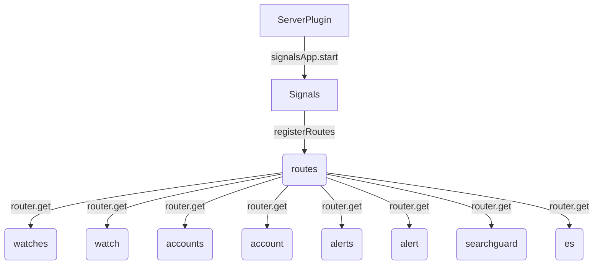

# Signals BE

```mermaid
graph TD
    A[ServerPlugin] -->|signalsApp.start| B[Signals]
    B -->|registerRoutes| C(routes)
    C -->|router.get| D(watches)
    C -->|router.get| E(watch)
    C -->|router.get| F(accounts)
    C -->|router.get| G(account)
    C -->|router.get| H(alerts)
    C -->|router.get| I(alert)
    C -->|router.get| J(searchguard)
    C -->|router.get| K(es)
```
